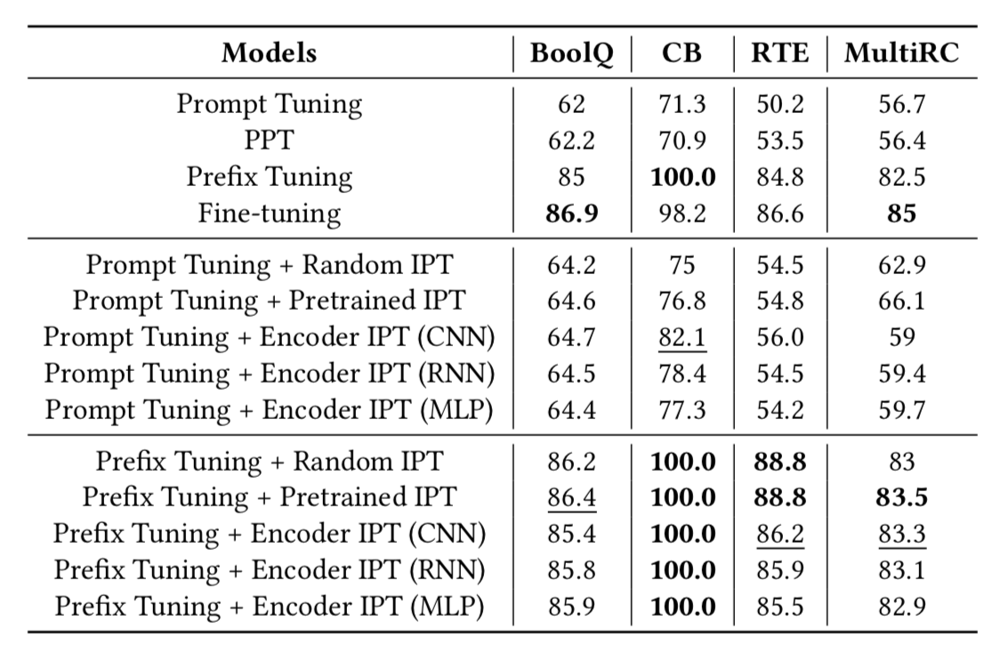
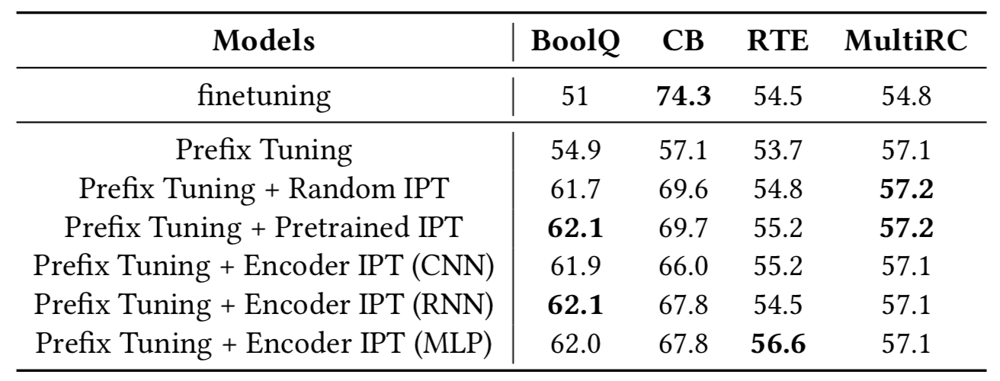
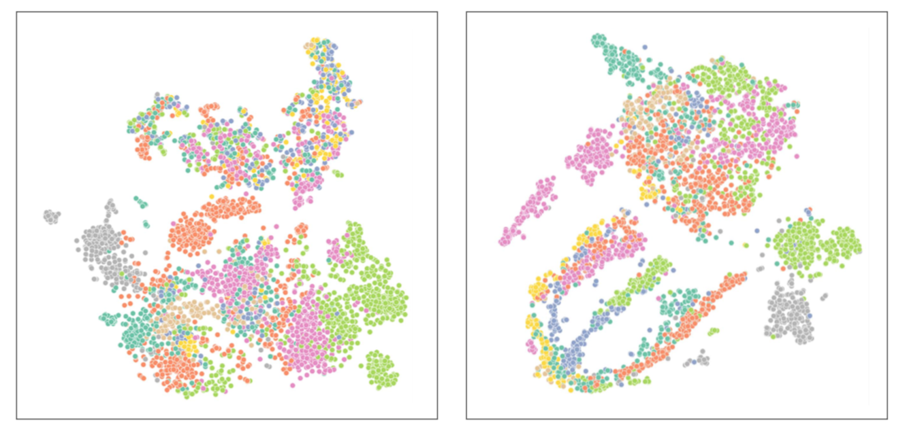
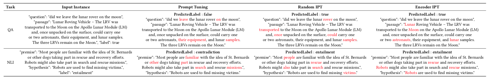
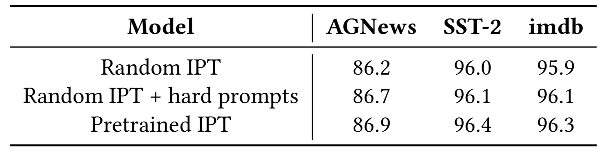
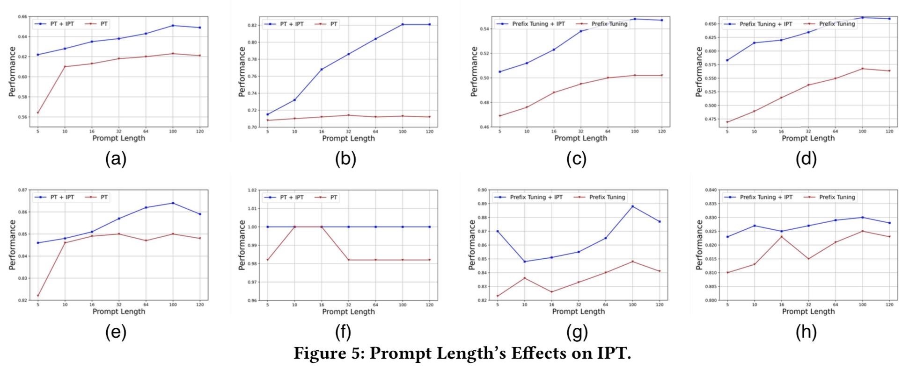
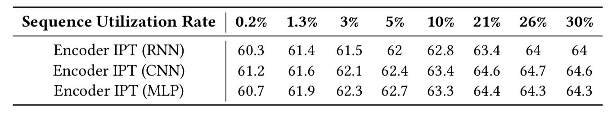

## Instance-wise Prompt Tuning for Pretrained Language Models


### Overview

This repository is the official implementation of paper **Instance-wise Prompt Tuning for Pretrained Language Models**. We first introduce **IPT(Instance-wise Prompt Tuning)**, the prompt learning paradigm that injects knowledge from the input data instances to the prompts, thereby providing PLMs with richer and more concrete context information.

On the [SuperCLUE benchmark](https://super.gluebenchmark.com/), we devise a series of strategies to produce instance-wise prompts, addressing various concerns like model quality and cost-efficiency. Across multiple tasks and resource settings, IPT significantly outperforms task-based prompt learning methods, and achieves comparable performance to conventional finetuning with only 0.5% - 1.5% of tuned parameters.


### Requirements

To install requirements:

```python
pip install -r requirements.txt
```

<!-- ### Downloads

#### Models

We should dowmload the checkpoints of model ,which has already in [HuggleFace](https://huggingface.co/roberta-large).

#### Datasets

We use [SuperGLUE](https://super.gluebenchmark.com/tasks) datasets  in our experiments. -->


### Training
To train the model(s) in the paper:
> WAY 1:
> run the ipynb notebook file "test_rte.ipynb"
>
> WAY 2:
> Execute the following command:
>
> python experiments/cli.py --config_yaml experiments/rte_roberta_large_cased_prompttuning.yaml


Yaml Configuration:the different strategys of IPT:

  > method: prefix-tuning/prompt-tuning                   
  > #prefix-tuning represents Prefix-Tuning, prompt-tuning represents Prompt-Tuning    
  >
  > instance: True/False                                 
  > #whether to use an instance-wise strategy   
  >
  > instance_pretrain: True/False                          
  > #whether to use a pretraining instance-wise strategy  
  >
  > encoder: cnn/mlp/lstm                                 
  > #different prompt generator strategies   
  >
  > emb_checkpoints: sequence_models/cpt/textcnn.pt         
  > #checkpoints of pretraining instance-wise strategy  
  >
  > fix_emb: True/False                                         
  > #whether to fix the embedding of prompt generator  

### Results

1. Accuracy comparison:

- Full-data Regime:



- ​	Few-shot Learning:

  

2. Interpretability:



3. Case Studies:



4. Effectiveness of Knowledge-enhanced Pretraining:



5. Hyperparameter Studies:

- Prompt Length:

  

- Sequence Utilization Rate:


